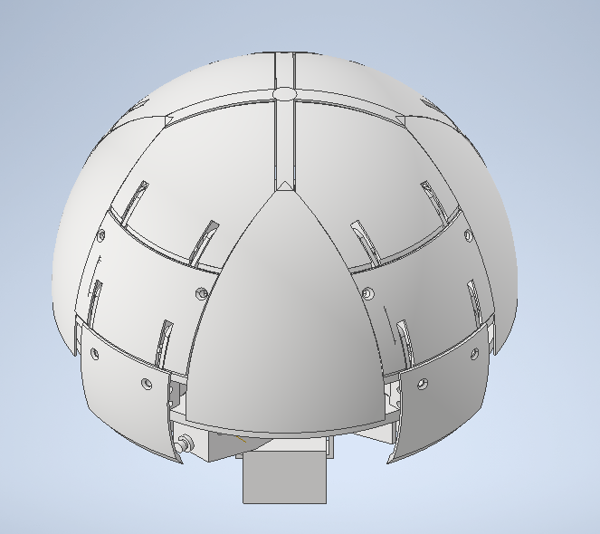
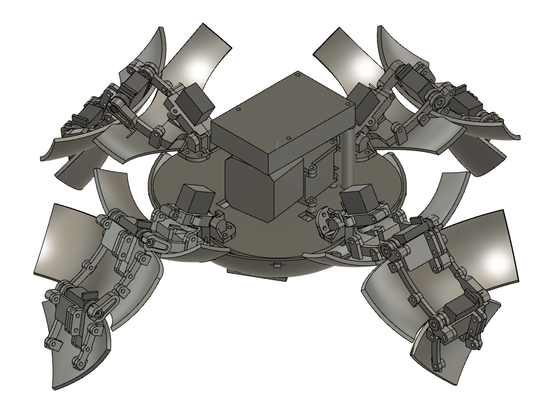
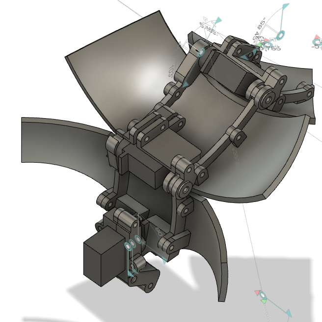

# savers

SAVERs は、森林監視を用途として想定した「球体から脚を展開できる変形ロボット」の開発アーカイブです。  
このディレクトリには、初期検討版 (`ver_1_and_2`) と発展版 (`ver_3`) の CAD データ、解析用コード、設計メモ、発表資料、製造資料、試作動画や写真、運営用資料がまとめて保存されています。

このリポジトリは一般的なソフトウェア開発用プロジェクトというより、**設計・試作・展示の履歴をまとめた保管庫**として構成されています。

## Images

公開向け README では、人が写る写真を避け、ロボット本体や CAD ベースの画像のみを掲載しています。

  
  

  

## 全体像

- `ver_1_and_2`
  初期構想から ver.2 までの機構検討・解析・初期 CAD 資料。
- `ver_3`
  ver.3 の設計完成版に近い CAD、製造関連資料、展示関連資料。

## `ver_1_and_2` の内容

初期段階の検討資料群です。脚を球体内部に収める機構や、展開・収縮時の挙動をどう成立させるかに重点があります。

### `ver_1_and_2/Code`

Python による簡易解析コードです。

- `Simulation.py`
  展開・収縮・釣り合い計算をひとつのクラスにまとめた試作コード。
- `Deploy.py`
  脚の展開動作を時系列で計算し、角度変化をプロットするスクリプト。
- `Contract_Motion.py`
  脚を収納する方向の運動を計算するスクリプト。
- `Contract_Balance.py`
  `scipy.optimize.fsolve` を使って、収縮時の力学的な釣り合いを求めるスクリプト。

コード中の変数名やコメントから、ばね定数、トルク、慣性、リンク長などを用いて脚機構をモデル化していることが分かります。

### `ver_1_and_2/Data`

初期設計の CAD/製造データです。

- `forFusion360`
  Fusion 360 / Inventor 系の部品・アセンブリ・テンプレート類。初期の本体、脚、カバー、フレームなどが含まれます。
- `Assembly_Completion`
  組立完成形に近いデータ群。
- `DXF_for_RASER`
  レーザー加工向けの DXF / SVG データ。
- `Solid_for_3Dprinter`
  3D プリンタ出力用のソリッドデータ。
- `SolidGroupAssembly`
  グループ化したアセンブリデータ。
- `Reference`
  設計要件や部品参照資料。

全体として、初期版では「球体に収まる脚機構」を成立させるための部品検討が中心です。

### `ver_1_and_2/Doccument`

メモや要件整理ファイルです。

- `設計要件.txt`
  「4本足」「内側に丸まる」「直径をできるだけ小さくする」などの基本要求を記録。
- 構想メモ
  森林・斜面での監視や災害時活用といった想定ユースケースのメモ。
- `program概要.txt`
  チーム活動に関する記録メモ。

### `ver_1_and_2/Images`

初期デザインや脚の状態変化を示す画像です。  
`Leg_in.png`、`Leg_out.png`、`Leg_deploy.png`、`Leg_contract.png` など、収納状態と展開状態を把握できます。

### `ver_1_and_2/slide_for_demoday`

デモデイ用スライドの書き出し画像です。初期版の発表内容を追うための資料群と見られます。

## `ver_3` の内容

ver.3 は、初期構想から一歩進んで、**設計・製造・展示運用まで含めた実制作アーカイブ**になっています。

### `ver_3/CADData`

ver.3 の中心となる CAD データ群です。

- `Module`
  `legModule.ipt`、`surboModule*.ipt`、`moduleAssmbly*.iam` など、ロボットを機能単位でまとめたモジュール設計。
- `Parts`
  上下シェル、脚まわり、ベース、サーボ搭載部などの個別部品。
- `3DPrinter`
  3D プリント前提の出力・修正版データ。
- `Components`
  `XL-330`、`MG92B`、コネクタ、ねじなど既製部品や周辺部材のモデル。
- `Parameters`
  寸法パラメータ管理用の Excel / XML。
- `RASER`
  レーザー加工向けデータ。
- `Schwag`
  ペーパークラフト関連データ。
- `OldVersions`
  旧版のバックアップ。

ファイル名から、ver.3 では脚モジュール、サーボモジュール、ベース、シェルを分けて設計し、製造方法ごとにデータを整理していることが分かります。

### `ver_3/Document`

実制作に必要な事務・調達・外注関連の資料です。

- `Bill`
  購入品や材料に関する管理資料。
- `Order`
  加工発注資料。
- `PaperCraft`
  ペーパークラフト用ソフトのライセンス関連書類。
- `Traveling`
  展示・移動に伴う内部管理資料。
- `NetBallVer3.xlsx`
  ver.3 の設計管理や部品表に関わる表計算資料と考えられます。

### `ver_3/SAVERS`

展示や検証のための周辺資料です。

- 試作機の動画: 展開動作や歩行動作の検証動画
- 写真: `PXL_*.jpg`、`DSC00094.jpg`
- 発表資料: プレゼンテーションファイル一式
- 部品資料: `XL,XC-330.pdf`、`Tower Pro MG92B.f3d`
- 展示関連: 展示準備用の補助資料

このフォルダは、単なる CAD 保管ではなく、**試作確認・発表・展示準備を含む実務フォルダ**です。

### `ver_3/Slide`

`Introduction.pptx` とその PDF 版があり、紹介用スライドが保存されています。

### `ver_3/Images`

`NetBallver3.png` があり、ver.3 を代表するビジュアル資料です。

### `ver_3/多摩ソフトウェア`

ペーパークラフト用データと画像群です。

- `schwag3.pdo`
  Pepakura Designer 系の展開図データ。
- `schwag3.svg`
  ベクタ形式の展開図。
- `Papercraft.zip`
  関連データ一式。
- `Images`
  実際のペーパークラフト完成写真。

## このディレクトリから分かること

- プロジェクトの主題は、**脚を球体内部に収納できる変形ロボット**の設計です。
- 初期版では、リンク機構と収納方式の検討、簡易シミュレーション、基本 CAD が中心です。
- ver.3 では、モジュール化された CAD、3D プリント・レーザー加工データ、購買・展示関連資料まで揃っており、実制作フェーズに入っていることが分かります。
- したがってこのリポジトリは、ソースコード集というより **ハードウェア開発プロジェクト全体の履歴保管庫**として読むのが適切です。

## まず見るとよい場所

- 初期コンセプトを把握したい場合
  `ver_1_and_2/Doccument` と `ver_1_and_2/Code`
- 初期の形状や機構を見たい場合
  `ver_1_and_2/Data` と `ver_1_and_2/Images`
- ver.3 の完成度の高い設計を見たい場合
  `ver_3/CADData`
- 展示・発表・試作の様子を見たい場合
  `ver_3/SAVERS` と `ver_3/Slide`
- ペーパークラフト関連を見たい場合
  `ver_3/多摩ソフトウェア` と `ver_3/Document/PaperCraft`
